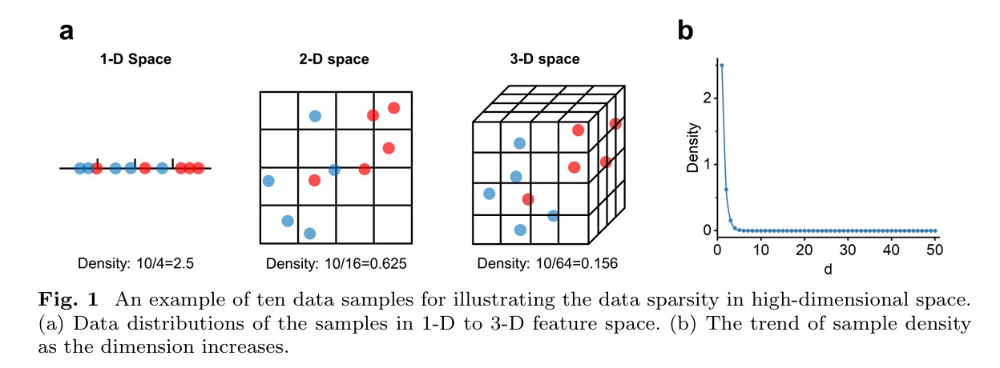

<div style="text-align:justify;">

[WIKIPEDIA](https://en.wikipedia.org/wiki/Curse_of_dimensionality)

#  **ایدهٔ اصلی: چرا فاصله‌ها در ابعاد بالا رفتار عجیب پیدا می‌کنند؟**

وقتی از فضای معمولی (۲ بعدی یا ۳ بعدی) به **فضای با ابعاد بسیار بالا** (مثلاً ۱۰۰ یا ۱۰۰۰ بعد) می‌رویم، فاصله‌ها رفتاری کاملاً متفاوت با تصور ما پیدا می‌کنند.

---

#  **نکتهٔ کلیدی ۱: فضای با ابعاد بالا «تقریباً در وسط خالی است»**

یک مکعب را در نظر بگیر. داخل آن یک کره قرار بده که به همهٔ دیواره‌ها می‌رسد.
در ۲ بعد یا ۳ بعد، کره بخش قابل توجهی از حجم مکعب را پر می‌کند.

اما در ابعاد بالا:

 **حجم کره تقریباً صفر می‌شود نسبت به حجم کل مکعب.**

یعنی:

* با این‌که کره به همهٔ دیواره‌ها می‌رسد،
* **تقریباً تمام فضای مکعب در گوشه‌ها قرار دارد** — جاهایی دور از مرکز.
* **«ناحیهٔ مرکزی» عملاً بسیار کوچک می‌شود.**

---

#  **نکتهٔ کلیدی ۲: نقاط تصادفی در یک مکعبِ پر‌بُعد، همگی از مرکز دورند**

اگر داخل یک مکعبِ با ابعاد بالا به‌طور تصادفی نقطه انتخاب کنیم:

* تقریباً هیچ‌کدام به مرکز نزدیک نیستند.
* بیشتر آن‌ها تقریباً در **یک فاصلهٔ مشخص** از مرکز قرار می‌گیرند.
* این فاصله حدوداً برابر است با:

$$
\sqrt{d/3}
$$

که در آن *d* تعداد ابعاد است.

مثلاً در ۱۰۰۰ بعد، فاصلهٔ معمول از مرکز بسیار زیاد است — و همهٔ نقاط تقریباً همین فاصله را دارند.

---

#  **نکتهٔ کلیدی ۳: فاصلهٔ بین نقاط تقریباً برابر می‌شود**

یک نقطهٔ تصادفی $Q$ بردارید.
حالا چند نقطهٔ دیگر $(P₁, P₂, ...)$.

در ابعاد بالا:

* **نزدیک‌ترین** نقطه به $Q$ خیلی دور است.
* **دورترین** نقطه هم خیلی دور است.
* و **تفاوت بین نزدیک‌ترین و دورترین بسیار کوچک** می‌شود نسبت به مقدار خود فاصله.

یعنی:

 **فاصلهٔ بین همهٔ نقاط تقریباً یکسان می‌شود.**

به همین دلیل می‌گویند:

> در ابعاد بالا، «کنتراست فاصله» از بین می‌رود.

وقتی همهٔ فاصله‌ها شبیه هم شوند، الگوریتم‌هایی مثل *نزدیک‌ترین همسایه* نمی‌توانند بفهمند کدام واقعاً نزدیک است.

اما این فقط در شرایط *کاملاً ایده‌آل و مصنوعی* اتفاق می‌افتد.

---

#  **نکتهٔ کلیدی ۴: این «نفرین ابعاد» فقط در داده‌های غیرواقعی رخ می‌دهد**

نتایج اصلی ریاضی فرض می‌کنند که:

* ✔ همهٔ مختصات مستقل‌اند
* ✔ همهٔ مختصات توزیع‌های یکسان دارند
* ✔ هیچ همبستگی یا الگوی خاصی وجود ندارد

اما داده‌های واقعی تقریباً *هیچ‌وقت* این‌طور نیستند.

پژوهش‌های جدید نشان می‌دهند:

* اگر دادهٔ شما **ساختار** داشته باشد
  (مثلاً همبستگی بین ویژگی‌ها، گروه‌های طبیعی، الگوهای دنیای واقعی)
* مشکل کاهش کنتراست فاصله **خیلی کمتر** می‌شود یا حتی برعکس می‌شود.
* فاصله‌ها می‌توانند در ابعاد بالا **مفیدتر** هم باشند.

بنابراین:

 **در داده‌های ساختاردار واقعی، فاصله‌ها در ابعاد بالا معنای خود را حفظ می‌کنند (یا بهتر هم می‌شوند).**

---

[arxiv](https://arxiv.org/pdf/2401.00422)

---

#  مسئله: چرا داده‌های با ابعاد بالا سخت می‌شوند؟ («نفرین ابعاد»)

وقتی فناوری‌های امروزی داده‌های بیشتری جمع‌آوری می‌کنند، معمولاً دو چیز بیشتر می‌شود:

1. تعداد **نمونه‌ها** (ردیف‌ها)
2. تعداد **ویژگی‌ها** یا **ابعاد** (ستون‌ها)

اما داشتن ویژگی‌های زیاد (ابعاد زیاد) مشکلات جدی ایجاد می‌کند.
یکی از مهم‌ترین آن‌ها **پراکندگی داده‌ها (Sparsity)** است.

---

#  پراکندگی در ابعاد بالا چیست؟

در ابعاد کم (مثل ۱ بعد یا ۲ بعد)، نقاط داده می‌توانند فضا را نسبتاً خوب پوشش دهند.
اما وقتی ابعاد بیشتری اضافه می‌کنیم، فضا به‌صورت **نمایی** رشد می‌کند و داده‌ها **بشدت پراکنده** می‌شوند.

### چرا؟

* شما **۱۰ نمونه** دارید
* هر ویژگی (بعد) به **۴ بازه** تقسیم شده است
  (می‌توان آن را تقسیم کردن هر محور به ۴ قسمت مساوی تصور کرد)

---

##  در فضای ۱-بعدی:

* فقط ۴ بازه وجود دارد
* 10 نمونه / 4 بازه = **۲.۵ نمونه در هر بازه**
  → نسبتاً متراکم

---

##  در فضای ۲-بعدی:

* هر ویژگی ۴ بازه دارد، و دو ویژگی داریم
* کل سلول‌ها = 4 × 4 = **۱۶**
* تراکم = 10 / 16 = **۰.۶۲۵ نمونه در هر سلول**

---

##  در فضای ۳-بعدی:

* کل سلول‌ها = 4 × 4 × 4 = **۶۴**
* تراکم = 10 / 64 = **۰.۱۵۶ نمونه در هر سلول**

---

##  به‌طور کلی:

در فضای **d بعدی**:

$$
\text{number of cells} = 4^d
$$

$$
concentration = 10 / 4^d
$$

وقتی تعداد ابعاد $d$ بالا می‌رود:

* مقدار (cells#) بسیار بزرگ می‌شود
* مقدار (concentration) به‌شدت کوچک می‌شود
* و تقریباً به **صفر** می‌رسد


---

#  این یعنی چه؟

حتی وقتی تعداد ویژگی‌ها فقط **۵** باشد، بیشتر سلول‌ها یا «ناحیه‌ها» در فضای ویژگی **خالی** هستند.

این یعنی:

* مدل در بیشتر قسمت‌های فضا **هیچ نمونه‌ای نمی‌بیند**
* نمی‌تواند یاد بگیرد در آن نواحی چه رفتاری داشته باشد
* داده آنقدر پراکنده می‌شود که مدل نمی‌تواند فضا را پوشش دهد

به عبارت دیگر:

 **فضای با ابعاد بالا خیلی سریع رشد می‌کند و دادهٔ ما برای پُر کردن آن کافی نیست.**

این بخش مهمی از «نفرین ابعاد» است.

---

#  چرا این برای یادگیری ماشین مشکل ایجاد می‌کند؟

چون مدل با مشاهدهٔ نمونه‌ها یاد می‌گیرد.

اما در ابعاد بالا:

* بیشتر ناحیه‌ها **بدون نمونه** هستند
* مدل مجبور است در آن نواحی **حدس** بزند
* و این باعث **عمومیت‌دهی ضعیف** و **بیش‌برازش (Overfitting)** می‌شود

حتی اگر هزاران یا میلیون‌ها نمونه داشته باشید، باز هم ممکن است کافی نباشد وقتی تعداد ابعاد بسیار زیاد باشد.

---

#  چرا پراکندگی داده‌ها در ابعاد بالا باعث بیش‌برازش می‌شود؟

وقتی داده‌ها ابعاد زیادی داشته باشند، **بشدت پراکنده** می‌شوند — یعنی نقاط از هم دور می‌شوند و به‌ندرت نزدیک هم قرار می‌گیرند.
این پراکندگی دو مشکل اصلی برای مدل‌های یادگیری ماشین ایجاد می‌کند:

1. **بیش‌برازش (Overfitting)**
2. **عمومیت‌دهی ضعیف (Poor Generalization)**

بیایید این مسئله را باز کنیم.

---

#  چگونه در ابعاد بالا بیش‌برازش اتفاق می‌افتد؟

یک طبقه‌بند (classifier) با مشاهدهٔ **نمونه‌های آموزشِ برچسب‌دار** الگو یاد می‌گیرد.
مثلاً یک SVM سعی می‌کند **بهترین مرز جداساز** (یک ابرصفحه) را بین کلاس‌ها پیدا کند.

اما وقتی داده در فضای با ابعاد بالا پراکنده باشد:

* طبقه‌بند در هر ناحیه **نمونهٔ کافی** نمی‌بیند.
* مرز تصمیم‌گیری مجبور می‌شود بسیار پیچیده شود تا همان چند نقطهٔ پراکنده را دقیقاً تطبیق دهد.
* این منجر به **دقت بالای آموزش** می‌شود، زیرا مدل نمونه‌ها را حفظ می‌کند.
* اما مدل روی داده‌های جدید **عملکرد ضعیفی** دارد، چون الگوی پایدار و کلی یاد نگرفته است.

به بیان ساده:

 **مدل به‌جای یادگیری ساختار واقعی، نویز را یاد می‌گیرد.**

این همان بیش‌برازش است — اما در ابعاد بالا بسیار شدیدتر می‌شود.

---

#  چرا عمومیت‌دهی از بین می‌رود؟

وقتی نمونه‌های جدید (بدون برچسب) وارد مدل می‌شوند:

* این نمونه‌ها اغلب در نواحی‌ای قرار می‌گیرند که در آموزش **هیچ نمونهٔ مشابهی** وجود نداشت.
* چون مدل دربارهٔ آن نواحی **اطلاعات کافی ندارد**، پیش‌بینی ضعیف انجام می‌دهد.
* این مشکل برای نمونه‌هایی با ویژگی‌هایی که حتی کمی با دادهٔ آموزشی متفاوت‌اند، شدیدتر است.

در نتیجه، مدل روی دادهٔ آموزش عالی است، اما روی دادهٔ واقعی یا تست **ناکارآمد** است.

---

#  چرا نمی‌توانیم به‌سادگی نمونه‌های بیشتری جمع کنیم؟

یکی از راه‌حل‌ها برای کاهش پراکندگی، افزایش تعداد نمونه‌هاست.
اما در عمل:

* جمع‌آوری دادهٔ برچسب‌دار هزینه‌بر است
* برچسب‌گذاری به تلاش انسانی نیاز دارد
* در برخی حوزه‌ها (پزشکی، سنجش از دور و …) مقدار دادهٔ قابل جمع‌آوری محدود است

پس:

 **به‌ندرت دادهٔ کافی برای پُر کردن فضای با ابعاد بالا داریم.**

به همین دلیل است که روش‌هایی مثل کاهش ابعاد، انتخاب ویژگی و منظم‌سازی (regularization) بسیار پرکاربرد هستند.

---

#  چرا اندازه‌گیری فاصله در ابعاد بالا از کار می‌افتد؟

(**مشکل تمرکز فاصله – Distance Concentration**)

در فضای با ابعاد بالا یک مشکل مهم دیگر ظاهر می‌شود:

 **تمام فاصله‌ها بین نقاط تقریباً شبیه هم می‌شوند.**

این پدیده را «تمرکز فاصله» می‌نامند.

---

#  تمرکز فاصله یعنی چه؟

وقتی تعداد ابعاد افزایش پیدا می‌کند:

* فاصلهٔ **نزدیک‌ترین** نقاط و **دورترین** نقاط
  **تقریباً یکسان** می‌شود.
* تفاوت بین «نزدیک» و «دور» از بین می‌رود.
* همه‌چیز تقریباً به یک اندازه از هم دور می‌شود.

در نتیجه، معیارهای معمول فاصله (مثل اقلیدسی، منهتن و …)
**معنی‌دار بودن خود را از دست می‌دهند.**

به بیان ساده:

 **وقتی همه چیز تقریباً یک فاصله دارد، دیگر نمی‌توان شباهت را درست اندازه گرفت.**

---

#  چرا این برای یادگیری ماشین مشکل ایجاد می‌کند؟

بسیاری از روش‌های یادگیری ماشین بر این فرض تکیه دارند که:

> «نقاط مشابه باید فاصلهٔ کمی از هم داشته باشند.»

اما وقتی فاصله معنی خود را از دست بدهد، این الگوریتم‌ها از کار می‌افتند.

---

#  مثال ۱: خوشه‌بندی DBSCAN

 خوشه‌ها را با:

* انتخاب یک شعاع محله (Eps)
* وصل کردن نقاطی که فاصله‌شان از هم کمتر از Eps باشد

تشخیص می‌دهد.

اما در ابعاد بالا:

* همهٔ فاصله‌ها تقریباً یکسان می‌شوند
* انتخاب مقدار مناسب Eps **بسیار دشوار** می‌شود

اگر Eps کوچک باشد → تقریباً هیچ نقطه‌ای همسایه نمی‌شود
اگر Eps بزرگ باشد → همهٔ نقاط یک خوشهٔ بزرگ تشکیل می‌دهند

بنابراین:

 **تمرکز فاصله باعث می‌شود DBSCAN در ابعاد بالا قابل اعتماد نباشد.**

---

#  مثال ۲: الگوریتم نزدیک‌ترین همسایه‌ها (KNN)

فرض KNN این است که:

> «همسایه‌های نزدیک باید برچسب مشابه داشته باشند.»

اما در فضای پر‌بعد:

* فاصلهٔ نزدیک‌ترین و دورترین همسایه تقریباً برابر می‌شود
* الگوریتم نمی‌تواند تشخیص دهد کدام نقطه واقعاً نزدیک است
* پیش‌بینی برچسب‌ها **مبهم و نادقیق** می‌شود

یعنی:

 **KNN توانایی تشخیص همسایه‌های واقعی را از دست می‌دهد.**

---

# راه حل

[geeksforgeeks](https://www.geeksforgeeks.org/machine-learning/curse-of-dimensionality-in-machine-learning/)

---

1. **تکنیک‌های کاهش ابعاد (Dimensionality Reduction Techniques):**

   **انتخاب ویژگی (Feature Selection):**
   شناسایی و انتخاب مهم‌ترین و مرتبط‌ترین ویژگی‌ها از میان ویژگی‌های اصلی داده و حذف ویژگی‌های بی‌اهمیت یا تکراری.
   این کار ابعاد داده را کاهش می‌دهد، مدل را ساده‌تر می‌کند و کارایی آن را بهبود می‌بخشد.

   **استخراج ویژگی (Feature Extraction):**
   تبدیل داده‌های پر‌بُعد اصلی به یک فضای کم‌بعد با ایجاد ویژگی‌های جدید که اطلاعات ضروری را حفظ می‌کنند.
   روش‌هایی مانند **تحلیل مؤلفه‌های اصلی (PCA)** و **t-SNE** از رایج‌ترین تکنیک‌های استخراج ویژگی هستند.

---

2. **پیش‌پردازش داده (Data Preprocessing):**

   **نرمال‌سازی (Normalization):**
   مقیاس‌بندی ویژگی‌ها به بازه‌ای مشابه برای جلوگیری از این‌که برخی ویژگی‌ها (به‌ویژه در الگوریتم‌های مبتنی بر فاصله) بر بقیه غالب شوند.

   **رسیدگی به داده‌های گمشده (Handling Missing Values):**
   مدیریت داده‌های ناقص از طریق **میان‌یابی (Imputation)** یا **حذف** آن‌ها، تا فرآیند آموزش مدل مقاوم‌تر و پایدارتر شود.

---

```python
import numpy as np
import pandas as pd
from sklearn.feature_selection import SelectKBest, f_classif, VarianceThreshold
from sklearn.decomposition import PCA
from sklearn.model_selection import train_test_split
from sklearn.preprocessing import StandardScaler
from sklearn.ensemble import RandomForestClassifier
from sklearn.metrics import accuracy_score
from sklearn.impute import SimpleImputer

df = pd.read_csv('your_dataset.csv')

# Assuming 'X' contains your features and 'y' contains your target variable
X = df.drop(columns=['Time', 'Pass/Fail'])
y = df['Pass/Fail']

# Remove constant features
selector = VarianceThreshold()
X_selected = selector.fit_transform(X)

# Impute missing values
imputer = SimpleImputer(strategy='mean')
X_imputed = imputer.fit_transform(X_selected)

# Perform feature selection
selector_kbest = SelectKBest(score_func=f_classif, k=20)
X_train_selected = selector_kbest.fit_transform(X_train_scaled, y_train)
X_test_selected = selector_kbest.transform(X_test_scaled)

# Perform dimensionality reduction
pca = PCA(n_components=10)
X_train_pca = pca.fit_transform(X_train_selected)
X_test_pca = pca.transform(X_test_selected)

# Train a classifier (e.g., Random Forest) without dimensionality reduction
clf_before = RandomForestClassifier(n_estimators=100, random_state=42)
clf_before.fit(X_train_scaled, y_train)

# Make predictions and evaluate the model before dimensionality reduction
y_pred_before = clf_before.predict(X_test_scaled)
accuracy_before = accuracy_score(y_test, y_pred_before)
print(f'Accuracy before dimensionality reduction: {accuracy_before}')
# Train a classifier (e.g., Random Forest) on the reduced feature set
clf_after = RandomForestClassifier(n_estimators=100, random_state=42)
clf_after.fit(X_train_pca, y_train)

# Make predictions and evaluate the model after dimensionality reduction
y_pred_after = clf_after.predict(X_test_pca)
accuracy_after = accuracy_score(y_test, y_pred_after)
print(f'Accuracy after dimensionality reduction: {accuracy_after}')
```

```plain
Accuracy before dimensionality reduction: 0.8745
Accuracy after dimensionality reduction: 0.9235668789808917
```


</div>